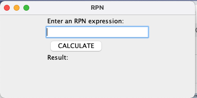

# stavnitser-mco152-2022

This is a repository for my class work for MCO-152 Computer Methodology at Touro in 2022

This project uses retrofit (link to retrofit)

list the api you used 
other libraries

This project uses:
- Gson
- [Retrofit](https://square.github.io/retrofit/)
- Mockito
- Junit
- Rx
- Gradle

